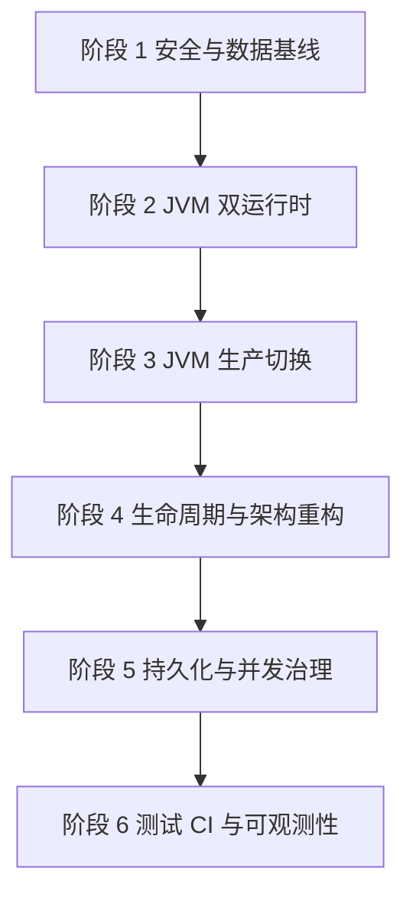

# Culvert JVM 迁移与重构总览

## 1. 背景

当前项目是基于 Babashka 的长期运行控制面，包含 HTTP、WebSocket、多用户认证、Docker/Podman、SmolVM、Caddy、socat、ttyd、S3 挂载及 JSON 状态持久化。

随着功能增长，项目已经超出一般脚本型应用的复杂度。主要风险集中在：

- 资源级授权规则不统一；
- 会话、CSRF 和外部日志终端存在安全缺口；
- 外部资源、内存 atom 和 JSON 状态之间缺少事务边界；
- 端口与配额分配存在并发竞争；
- 后台线程和进程缺少统一生命周期管理；
- 工具链、测试和发布流程不可完全复现。

因此计划将生产运行时逐步迁移到 JVM Clojure，并同步进行必要的安全和架构治理。

## 2. 技术决策

### 2.1 目标运行时

- Eclipse Temurin JDK `26.0.2+10`；
- Clojure JVM；
- `deps.edn` 管理依赖和开发 alias；
- `tools.build` 构建 uberjar；
- `bb.edn` 保留为开发辅助任务入口；
- 迁移期间 Babashka 与 JVM 双运行，稳定后再决定是否停止支持 Babashka。

Temurin `26.0.2+10` 是本项目唯一验证和部署基线。该版本不是 LTS，因此开发、CI、构建与生产环境必须同时固定供应商、feature release、补丁版本和 build number；不得将约束放宽为任意 JDK 26。后续升级通过独立变更完成兼容性测试、灰度和回滚验证，不在日常部署中自动漂移。

### 2.2 为什么不默认使用 Leiningen

当前项目依赖规模不大，也没有依赖 Lein 插件体系。`deps.edn + tools.build` 更接近官方工具链，适合将运行、测试和构建职责拆开。

只有在团队现有基础设施强依赖 Leiningen 时，才考虑改用 `project.clj`。迁移目标是 JVM，而不是必须采用 Leiningen。

## 3. 核心原则

1. **先安全、后迁移**：优先关闭已知越权和凭据暴露问题。
2. **迁移与重构解耦**：先让同一份业务代码在 JVM 上运行，再调整架构。
3. **保持可回滚**：生产切换前保留 Babashka 启动路径。
4. **每阶段独立验收**：未达到退出标准，不进入下一阶段。
5. **外部副作用可替换**：Docker、Caddy、SmolVM、socat、ttyd 等调用必须逐步收口到 adapter。
6. **状态变化可恢复**：所有资源操作最终应具备幂等、补偿和 reconciliation 能力。
7. **不覆盖现有工作**：实施前检查工作区，现有未提交修改必须先确认归属。

## 4. 阶段划分

| 阶段 | 文档 | 目标 |
|---|---|---|
| 0 | 本文档 | 明确决策、边界和整体路线 |
| 1 | `01-安全与数据基线.md` | 修复高风险安全问题，隔离真实运行数据 |
| 2 | `02-JVM双运行时迁移.md` | 在不大改业务逻辑的前提下支持 JVM |
| 3 | `03-JVM生产切换.md` | 构建、部署并切换到 JVM 生产运行时 |
| 4 | `04-生命周期与架构重构.md` | 重构授权、生命周期、adapter 和应用层 |
| 5 | `05-持久化与并发治理.md` | 建立事务、状态机、配额和端口一致性 |
| 6 | `06-测试CI与可观测性.md` | 建立质量门禁、集成测试和运维观测 |

## 5. 总体依赖关系

阶段 1 和阶段 2 的部分低冲突任务可以并行，但资源授权、会话和真实凭据问题不能等待生产切换后再修复。

## 6. 里程碑

### M1：安全基线完成

- 普通用户无法操作其他用户资源；
- 日志 ttyd 不再公网裸露；
- 真实配置和运行状态不再由 Git 管理；
- 密码修改、角色变化、用户删除可以撤销旧会话。

### M2：JVM 兼容完成

- JVM 能加载全部生产 namespace；
- 同一套单元测试可在 Babashka 和 JVM 下执行；
- 开发环境使用标准 nREPL；
- 依赖和工具版本被锁定。

### M3：JVM 生产切换完成

- 可重复构建 uberjar；
- 测试环境完成资源恢复、HTTP、WebSocket 和关闭验证；
- 生产部署有明确回滚命令和数据备份。

### M4：架构治理完成

- namespace 加载不启动线程或外部进程；
- 所有资源变更通过 application service 和领域授权；
- 外部命令通过可替换 adapter 调用；
- system 可以幂等启动和停止。

### M5：状态一致性完成

- 端口和配额原子预留；
- 资源操作具有状态机和补偿逻辑；
- 持久化支持事务、schema 版本和备份恢复；
- 启动 reconciliation 可以识别状态漂移。

### M6：工程质量完成

- CI 强制执行测试、lint、格式和构建；
- 单元测试与外部集成测试分离；
- 日志具备请求和资源上下文；
- 有可执行的部署、备份、恢复和故障处理文档。

## 7. 明确不在首轮范围内的内容

- 不在 JVM 迁移阶段重写前端或替换 HTMX；
- 不在 JVM 迁移阶段替换所有业务 atom；
- 不同时替换 HTTP Server、模板引擎和全部依赖；
- 不为了抽象而建立统一所有 runtime 特性的庞大协议；
- 不在没有备份和兼容读取方案时直接删除 JSON 数据。

## 8. 变更管理

每个阶段建议拆为多个小型 PR：

1. 测试或保护措施；
2. 兼容性改动；
3. 行为切换；
4. 删除旧实现。

每个 PR 应包含：

- 变更范围；
- 行为影响；
- 执行过的验证；
- 数据迁移说明；
- 回滚方式。
