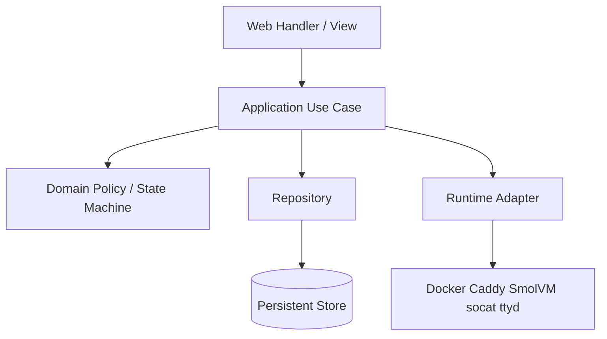

# 阶段 4：生命周期与架构重构

## 1. 阶段目标

在 JVM 生产运行稳定后，减少全局状态与隐式副作用，建立清晰的 Web、Application、Domain 和 Infrastructure 边界。

## 2. 目标分层



职责：

- Web：HTTP 解析、身份提取、响应渲染；
- Application：用例编排、事务边界、事件产生；
- Domain：授权、配额、状态转换、不变量；
- Infrastructure：外部命令、数据库、HTTP Server、文件系统。

## 3. 工作项

### 3.1 建立 system lifecycle

可使用 Integrant，也可以先实现轻量 system map。选型以团队熟悉度和依赖成本为准。

目标接口：

```clojure
(def system (start-system! config))
(stop-system! system)
```

system 至少管理：

- HTTP server；
- WebSocket broadcaster；
- token/CSRF/rate-limit cleaner；
- repository；
- process supervisor；
- Caddy adapter；
- Docker/Podman adapter；
- SmolVM adapter；
- ttyd、socat 和挂载资源。

要求：

- start/stop 幂等；
- 启动中途失败时逆序停止已启动组件；
- namespace 加载无副作用；
- shutdown 汇总错误，不吞掉异常后声称完全成功；
- 测试可启动最小 system。

### 3.2 引入 application service

建议按业务拆分：

```text
culvert.application.forward
culvert.application.caddy
culvert.application.container
culvert.application.machine
culvert.application.user
```

每个用例显式接收依赖、actor 和 command：

```clojure
(create-container! deps actor command)
(toggle-container-port! deps actor command)
(delete-user! deps actor command)
```

任务：

1. Handler 不再直接修改领域 atom；
2. Handler 不直接执行 CLI；
3. 用例入口统一执行授权和输入校验；
4. 领域错误使用带 `ex-data` 的明确类型；
5. Web 层将领域错误映射为稳定 HTTP 响应。

### 3.3 拆分大型 Web Handler

将 `src/culvert/web/handlers.clj` 按资源拆分：

```text
web/handlers/forward.clj
web/handlers/caddy.clj
web/handlers/docker.clj
web/handlers/smolvm.clj
web/handlers/admin.clj
web/routes.clj
```

任务：

1. 路由声明 method、path、auth、role 和 CSRF；
2. 提取统一 mutation wrapper；
3. 统一 request ID 和错误处理；
4. 避免每个 Handler 重复抓取全部 atom 快照；
5. 保持领域层授权作为最终边界。

### 3.4 建立查询层和稳定 DTO

视图不应直接读取资源 atom 或运行外部命令。

建议查询接口：

```clojure
(dashboard-snapshot deps actor)
(container-detail deps actor id)
(admin-overview deps actor)
```

任务：

1. 定义稳定的公开 DTO；
2. runtime capability 在启动或定时任务中探测并缓存；
3. 视图函数只接收 DTO；
4. WebSocket 使用领域事件或变更主题，而不是比较多个全局 atom；
5. 同一请求使用一致快照。

### 3.5 提取有限的 runtime 公共组件

Docker 和 SmolVM 当前共享大量能力。优先提取：

- `port-pool`
- `authorization`
- `ttyd-supervisor`
- `proxy-binding`
- `workspace-public-view`
- `process-supervisor`

runtime adapter 只表达真正一致的操作：

```clojure
(create! runtime spec)
(start! runtime id)
(stop! runtime id)
(delete! runtime id)
(status runtime id)
```

Docker 或 VM 特有能力保留在各自 adapter，避免为了统一接口丢失语义。

### 3.6 领域事件

Mutation 成功后产生事件，例如：

```clojure
{:type :container/created
 :resource-id id
 :owner username
 :timestamp now}
```

用途：

- WebSocket/OOB 刷新；
- 审计日志；
- 指标；
- 后续异步 reconciliation。

第一版可以同步分发，不必立即引入消息队列。

## 4. 迁移策略

采用逐模块 strangler 方式：

1. 先为旧函数补 characterization tests；
2. 新增 application service；
3. 单个 Handler 切换到新入口；
4. 验证后删除旧调用路径；
5. 再迁移下一个模块。

建议顺序：

1. Forward；
2. Caddy；
3. Docker 端口管理；
4. Docker 生命周期；
5. SmolVM；
6. Admin/User。

## 5. 退出标准

- namespace 加载无线程和外部进程副作用；
- system 可重复 start/stop；
- Web 层不直接访问资源 atom 或外部 CLI；
- 所有资源 mutation 经过 application service；
- Docker 和 SmolVM 的公共能力不再重复实现；
- WebSocket 刷新由明确事件驱动；
- 核心模块保持行为回归测试通过。

## 6. 风险控制

- 每次只迁移一个业务垂直切片；
- 不同时更换 HTTP 框架；
- 新旧 DTO 并存时记录弃用期限；
- 抽取公共协议前先确认至少两个真实实现语义一致；
- 出现复杂抽象时优先保留少量重复，不建立万能 runtime 接口。
